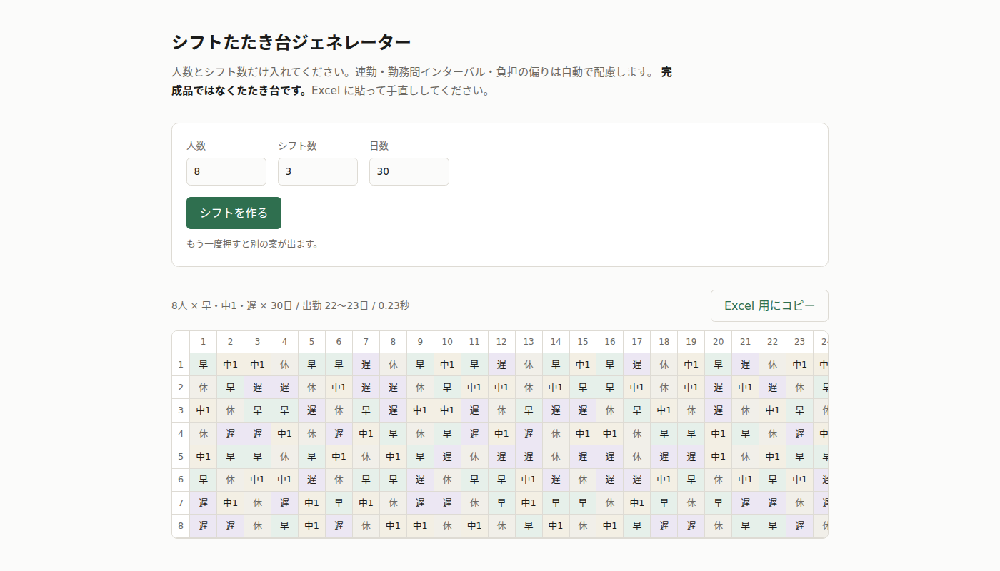

# シフトたたき台ジェネレーター

**https://kwrkb.github.io/schedule-gen/**



人数とシフト数を入れるだけで、それなりに人道的な1ヶ月シフトの**たたき台**を出す Web ツール。
登録不要、入力は3項目、データはブラウザの外に出ません。

完成品ではありません。出力を Excel に貼って手直しする前提で作っています。
個別事情（あの人とあの人は組ませない、来週は研修がある）は人間しか知らないので、
ツールは「手直しの起点」を最速で出すことに徹します。

## 自動で効く配慮

ユーザーは何も設定しません。以下は常に裏で効いています。

**必ず守る**

- 連勤は6日まで
- 各シフトに毎日1人以上
- 遅番の翌日に早番を入れない（勤務間インターバル11時間の近似）

**できるだけ均等に**

- 出勤日数（週休2日相当）
- 遅番の回数
- 休みが飛び石で散る
- 同一シフトが3日以上続かない

## 使わないもの

| 項目 | 理由 |
|---|---|
| 休み希望・定休日の入力 | 入力の手間がリピート利用の壁になる。手直しで対応する領域 |
| 土日祝の考慮 | 土日休みの公平化は年単位でしか成立しない。月次ツールの守備範囲外 |
| データの保存・ユーザー登録 | 入力が3項目なので保存する価値がない。導入障壁もゼロにできる |
| LLM | API コストと精度リスクを排除。古典的アルゴリズムで足りる |

細かく制約を設定したい人は対象外です。そういう用途は ChatGPT や Claude に直接頼むほうが向いています。

## 仕組み

**焼きなまし法による交換ベースの局所探索**を、時間予算（既定 800ms、最大12回）の範囲で
複数回走らせ、ハード制約違反の少ない解を採ります。制約ソルバーも LLM も使っていません。

核になっているのは**列構成固定方式**です。1日分の「列」（早1人、中1人、…、遅1人、残りは休み）を
作って全日にコピーし、あとは同じ日の2人を交換して改善していきます。交換なので列構成が壊れず、
「各シフトに毎日1人以上」が探索中つねに満たされます。

各ケース20シードでの実測値（最悪値）:

| ケース | 時間 | 出勤日数の幅 | 遅番回数の幅 | 違反 |
|---|---|---|---|---|
| 8人×3シフト×30日 | 0.23s | 1日 | 1回 | 0 |
| 20人×3シフト×31日 | 0.45s | 1日 | 1回 | 0 |
| 50人×4シフト×31日 | 0.82s | 1日 | 1回 | 0 |

延べ出勤枠（1日の出勤人数 × 日数）が人数で割り切れない限り完全均等は不可能です。
8人なら1日6人出勤で 180÷8 = 22.5 となり、差1はほぼ理論限界です。
詳細は [VISION.md](VISION.md) を参照してください。

## 開発

```sh
npm install
npm run dev        # 開発サーバー
npm test           # ソルバーの検証（7ケース × 5シード）
npm run build      # 静的ファイルを dist へ出力
```

ランタイム依存はゼロです。ビルド成果物は依存のない静的ファイルのみ（JS 7 kB / CSS 2 kB）。
`master` への push で GitHub Actions がテスト・ビルド・デプロイを実行します。

## ドキュメント

| ファイル | 役割 |
|---|---|
| [VISION.md](VISION.md) | 目的・スコープ・設計判断（正典） |
| [PLAN.md](PLAN.md) | フェーズ進捗 |
| [LESSONS.md](LESSONS.md) | なぜこうなっているか。何を試して捨てたか |
| `proto/prototype_shift.py` | アルゴリズムの原型（Python） |

## ライセンス

[MIT](LICENSE)
